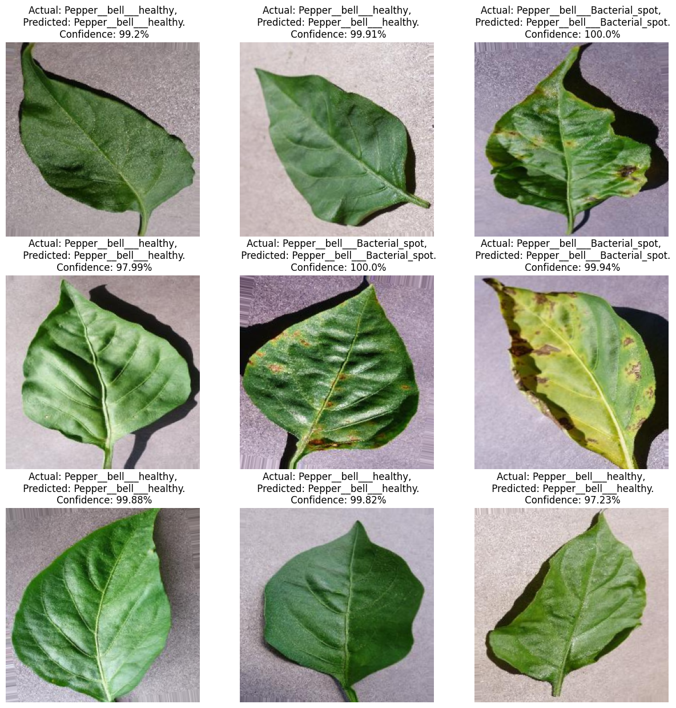

# CropCare AI
#### Logo
<div align="center">
    
</div>
## Project Overview
CropCare AI is a deep learning-based application for classifying potato diseases. It includes a trained machine learning model deployed via FastAPI, a React frontend, and a React Native mobile application.

## Setup Instructions

### Python Setup
1. Install Python (Setup instructions)
2. Install required Python packages:
   ```sh
   pip3 install -r training/requirements.txt
   pip3 install -r api/requirements.txt
   ```
3. Install TensorFlow Serving (Setup instructions)

### ReactJS Setup
1. Install Node.js (Setup instructions)
2. Install NPM (Setup instructions)
3. Install dependencies:
   ```sh
   cd frontend
   npm install --from-lock-json
   npm audit fix
   ```
4. Copy `.env.example` as `.env` and update the API URL if needed.

### React Native Setup
1. Follow the [React Native CLI Quickstart](https://reactnative.dev/docs/environment-setup) for your OS.
2. Install dependencies:
   ```sh
   cd mobile-app
   yarn install
   ```
3. (Mac users only) Install pods:
   ```sh
   cd ios && pod install && cd ../
   ```
4. Copy `.env.example` as `.env` and update the API URL.

## Model Training
1. Download the dataset from Kaggle.
2. Keep only folders related to potatoes.
3. Run Jupyter Notebook:
   ```sh
   jupyter notebook
   ```
4. Open `training/potato-disease-training.ipynb` and update the dataset path.
5. Run all cells.
6. Save the generated model with a version number in the `models` folder.

## Running the API

### Using FastAPI
1. Navigate to the API folder:
   ```sh
   cd api
   ```
2. Run the FastAPI server:
   ```sh
   uvicorn main:app --reload --host 0.0.0.0
   ```
3. The API will be available at `http://0.0.0.0:8000`

### Using FastAPI & TensorFlow Serving
1. Copy `models.config.example` as `models.config` and update paths.
2. Run TensorFlow Serving:
   ```sh
   docker run -t --rm -p 8501:8501 -v C:/Code/potato-disease-classification:/potato-disease-classification tensorflow/serving --rest_api_port=8501 --model_config_file=/potato-disease-classification/models.config
   ```
3. Run the FastAPI server:
   ```sh
   uvicorn main-tf-serving:app --reload --host 0.0.0.0
   ```

## Running the Frontend
1. Navigate to the frontend folder:
   ```sh
   cd frontend
   ```
2. Copy `.env.example` as `.env` and update `REACT_APP_API_URL` if needed.
3. Start the frontend:
   ```sh
   npm run start
   ```

## Running the Mobile App
1. Navigate to the mobile app folder:
   ```sh
   cd mobile-app
   ```
2. Copy `.env.example` as `.env` and update the API URL if needed.
3. Run the app on Android/iOS:
   ```sh
   npm run android
   # or
   npm run ios
   ```

## Creating a TF Lite Model
1. Run Jupyter Notebook:
   ```sh
   jupyter notebook
   ```
2. Open `training/tf-lite-converter.ipynb` and update the dataset path.
3. Run all cells.
4. The model will be saved in the `tf-lite-models` folder.

## Deploying the Model on Google Cloud Platform (GCP)

### Deploying TF Lite Model
1. Create a GCP account and project.
2. Create a GCP bucket and upload `models/potatos.h5`.
3. Install Google Cloud SDK (Setup instructions).
4. Authenticate:
   ```sh
   gcloud auth login
   ```
5. Deploy the function:
   ```sh
   cd gcp
   gcloud functions deploy predict_lite --runtime python38 --trigger-http --memory 512 --project <project_id>
   ```

### Deploying TF Model (.h5)
1. Upload `models/potato-model.h5` to GCP.
2. Deploy the function:
   ```sh
   cd gcp
   gcloud functions deploy predict --runtime python38 --trigger-http --memory 512 --project <project_id>
   ```
3. Use Postman to test the deployed function using the trigger URL.

## Demo Images
Below are some sample images from the project:
#### Home Screen APP
<div align="center">
    
</div>

#### Home Screen Web
<div align="center">
    
</div>

#### Home Screen Web
<div align="center">
    
</div>
#### Model
<div align="center">
    
</div>

## References
- [Serving TensorFlow Models with Cloud Functions](https://cloud.google.com/blog/products/ai-machine-learning/how-to-serve-deep-learning-models-using-tensorflow-2-0-with-cloud-functions)

